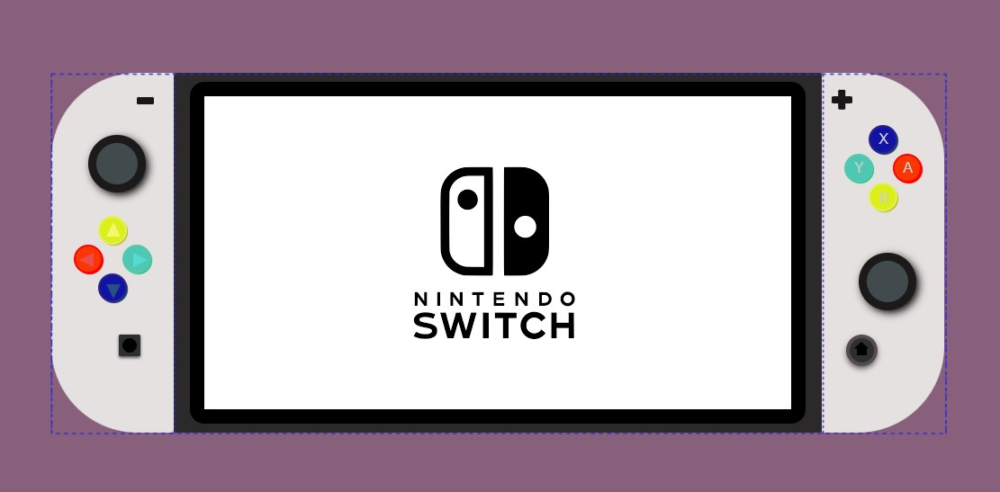
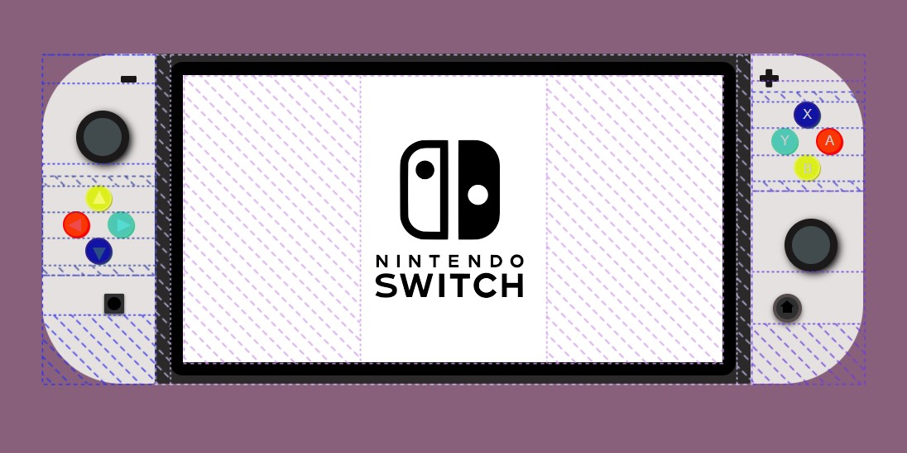

###         Nintendo Switch White  

Este es el primer proyecto de mi entrenamiento como full stack developer. He plasmado la planta de una consola switch de nintendo.

#### Proceso:
He realizado un contenedor como elemento principal, el cual he dividido en 3 partes, 2 controles a cada lado y una pantalla principal en el medio. He utilizando divs y clases. 
El diseño es bastante básico pero me siento  orgullosa del resultado. 

##### División contenedor principal: 

##### Divisiones hijo: 

##### Resultado final:

#### Tecnologías utilizadas: 

